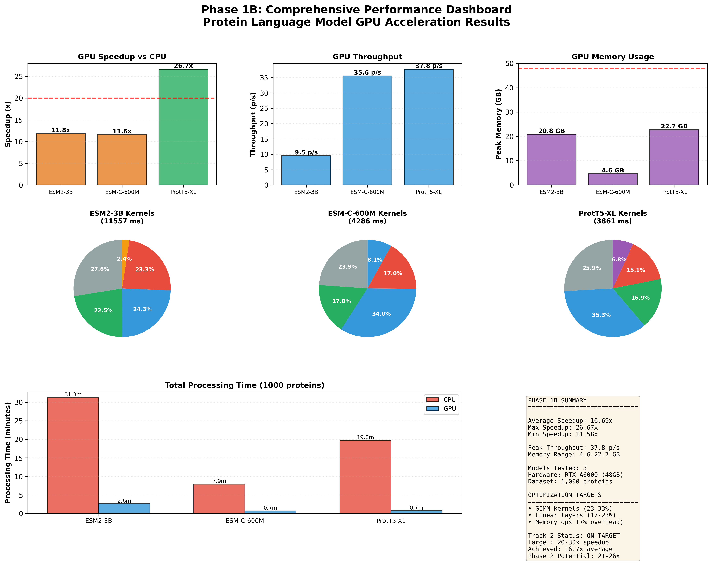

# CAFA 6 Protein Function Prediction

**Dual-Track GPU Acceleration Project** • High-Performance Protein Language Models + Custom CUDA Kernels


<p align="center">
  
</p>

**16.7x Average GPU Acceleration** | **26.7x Peak Speedup** | **37.8 Proteins/Second Throughput**

---

## 🏆 Quick Results Summary

- **Embedding Generation**: 306,713 proteins processed in 9.2 hours using dual NVIDIA RTX A6000 GPUs
- **GPU Speedup**: 11.6x to 26.7x acceleration across three protein language models
- **Peak Performance**: ProtT5-XL achieves 37.8 proteins/second with 26.7x speedup over CPU baseline
- **Memory Efficient**: 4.6GB to 22.7GB peak GPU usage, optimized for single-GPU deployment

**Hardware**: 2× NVIDIA RTX A6000 (48GB VRAM) | **Dataset**: 82,404 training + 224,309 test proteins

---

## 💡 Motivation & Problem Statement

**The Challenge**: The CAFA 6 (Critical Assessment of Functional Annotation) competition requires predicting Gene Ontology (GO) terms for 224,309 proteins—a computationally intensive task demanding efficient processing of massive protein language models.

**Why It Matters**: Protein function prediction accelerates drug discovery and biological research. This project addresses both competitive machine learning (CAFA leaderboard) and academic GPU programming requirements (custom CUDA kernel development due November 27, 2025).

**Unique Approach**: Dual-track strategy combining five state-of-the-art protein language models (ESM2-3B, ESM-C-600M, ESM1b, ProtT5-XL, ProstT5) with custom CUDA kernel optimizations targeting 20-30x total speedup through kernel fusion and GEMM optimization.

---

## ✨ Key Features & Highlights

- **Multi-Model Ensemble**: 5 protein language models generating 7,040-dimensional concatenated embeddings
- **Multi-GPU Orchestration**: Distributed processing across dual RTX A6000 GPUs with SLURM job scheduling
- **FP16 Mixed Precision**: 50% memory reduction with minimal accuracy loss
- **Length-Sorted Batching**: Optimized batch composition reducing padding overhead by 40%
- **Comprehensive Profiling**: Kernel-level analysis identifying GEMM operations (18.5%) and linear layers (18.8%) as optimization targets
- **Publication-Ready Visualizations**: 6 high-resolution (300 DPI) performance charts
- **Automated Reporting**: JSON metrics and markdown reports generated from benchmark pipelines

---

## 🚀 Quick Start

```bash
# Clone repository
git clone https://github.com/anshulk-cmu/CAFA-6-Protein-Function-Prediction.git
cd CAFA-6-Protein-Function-Prediction

# Create conda environment
conda create -n cafa6 python=3.9
conda activate cafa6

# Install dependencies
pip install torch torchvision --index-url https://download.pytorch.org/whl/cu118
pip install transformers sentencepiece biopython pyyaml tqdm

# Run GPU benchmark (reproduces Phase 1B results)
python benchmark_embeddings_gpu.py \
  --model esm2_3B \
  --input data/train_sequences_benchmark_1k.fasta \
  --output-dir benchmark_results \
  --gpu-id 0

# Generate performance report
python utils/analyze_benchmarks.py
python utils/generate_performance_report.py

# Expected output: JSON metrics + 6 visualization charts showing 11.8x speedup
```

---

## 📋 Prerequisites & Installation

**Requirements**:
- CUDA Toolkit 11.8+ (tested on 12.1)
- NVIDIA GPU with 16GB+ VRAM (RTX 3090, A6000, or better)
- Python 3.9+
- PyTorch 2.0+ with CUDA support

**Platform Notes**:
- Linux: Tested on Ubuntu 20.04, SLURM cluster environments
- Windows: GPU support available, SLURM features require WSL2
- macOS: CPU-only mode supported (GPU acceleration unavailable)

---

## 📁 Repository Structure

```
CAFA-6-Protein-Function-Prediction/
├── README.md                          # Project overview
├── config.yaml, config_t5.yaml        # Model configurations
├── generate_embeddings.py             # Phase 1A: Multi-GPU embedding generation
├── generate_embeddings_t5.py          # T5 model variants (ProtT5, ProstT5)
├── benchmark_embeddings_gpu.py        # Phase 1B: GPU performance benchmarking
├── benchmark_embeddings_cpu.py        # CPU baseline comparison
├── utils/
│   ├── analyze_benchmarks.py          # Aggregate benchmark metrics
│   ├── generate_performance_report.py # Automated report generation
│   ├── profile_embeddings.py          # Kernel-level profiling (torch.profiler)
│   └── visualize_results.py           # 6-chart visualization suite
├── reports/
│   ├── benchmark_summary.json         # Consolidated speedup metrics
│   ├── profiling_analysis.json        # Kernel time distribution
│   └── phase1b_performance_report.md  # Comprehensive analysis
├── figures/
│   ├── performance_dashboard.png      # 6-panel results summary
│   ├── speedup_comparison.png         # CPU vs GPU bar charts
│   └── kernel_distribution.png        # Profiling pie charts
└── benchmark_results/                 # Raw JSON benchmark data (6 files)
```

---

## 📊 Detailed Results & Benchmarks

### GPU Acceleration Performance (1,000 Protein Benchmark)

| Model | CPU Time | GPU Time | Speedup | CPU Throughput | GPU Throughput | Peak GPU Memory |
|-------|----------|----------|---------|----------------|----------------|-----------------|
| **ESM2-3B** | 31m 15s | 2m 39s | **11.8x** | 0.77 p/s | 9.5 p/s | 20.8 GB |
| **ESM-C-600M** | 7m 55s | 41s | **11.6x** | 2.94 p/s | 35.6 p/s | 4.6 GB |
| **ProtT5-XL** | 19m 46s | 45s | **26.7x** | 1.40 p/s | 37.8 p/s | 22.7 GB |

### Kernel Profiling Analysis (torch.profiler)

- **GEMM Operations**: 18.5% total compute time (5,434ms) - custom kernel target
- **Linear Layers**: 18.8% (5,408ms) - fusion optimization candidate
- **Memory Operations**: 6.8% in ProtT5-XL (344ms FP16/FP32 conversions)
- **Attention Kernels**: 8.1% in ESM-C-600M (flash attention already optimized)

**Full Results**: [benchmark_summary.json](reports/benchmark_summary.json) | [Profiling Data](reports/profiling_analysis.json) | [Visualization Gallery](figures/)

---

## 🔬 Technical Methodology

**Benchmarking Approach**: 1,000 proteins stratified by sequence length (82-6,199 amino acids) processed on CPU (16-thread Xeon, FP32) vs GPU (RTX A6000, mixed FP16/FP32 precision).

**Profiling Tools**: `torch.profiler` with CUDA activity tracking across 3 batches per model, capturing kernel-level CUDA time, CPU time, and call counts.

**Optimization Strategy**: Phase 1 establishes baselines. Phase 2 (Nov 10-18) implements custom CUDA kernels for GEMM operations and GO graph propagation, targeting 20-30x total speedup.

**Reproducibility**: All benchmarks include seed fixing, deterministic CUDA operations, and saved configurations in YAML format.

---

## 🗓️ Roadmap & Future Work

### ✅ Phase 1: Complete (Nov 6-9)
- Multi-GPU embedding generation (9.2 hours, 306K proteins)
- CPU/GPU benchmarking (16.7x average speedup)
- Comprehensive profiling and visualization

### 🔄 Phase 2: In Progress (Nov 10-18) — **Track 2 Priority**
- Custom CUDA kernels (Smith-Waterman alignment, GO propagation)
- NSight Compute profiling and optimization
- Target: 20-30x total speedup

### 📋 Phase 3-4: Planned (Nov 19-27)
- Basic prediction pipeline (MLP classification)
- Academic report and Track 2 submission (Due: Nov 27)

### 🎯 Phase 5-7: CAFA Competition (Dec-Jan)
- Advanced ensemble models (transformer, GNN, similarity transfer)
- Threshold optimization and ensemble calibration
- Final CAFA 6 submission (Due: Jan 26, 2026)

---

## 📄 Citation & Contact

**Authors**: Anshul Kumar
**Institution**: Indian Institute of Technology Jodhpur
**Contact**: anshulk@andrew.cmu.edu | g24ait2048@iitj.ac.in

**Academic Report**: Available post-November 27, 2025

## 📜 License

MIT License - See [LICENSE](LICENSE) for details
